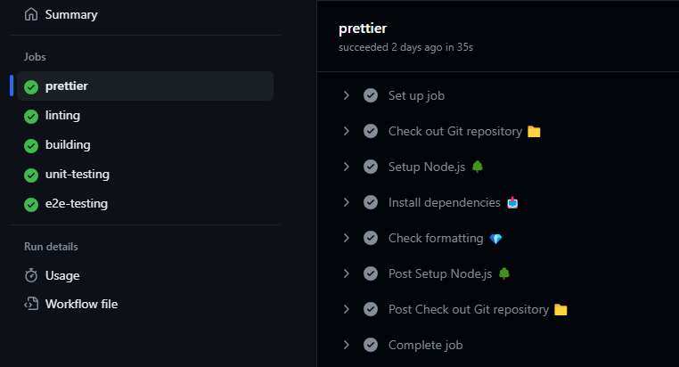

# Angular-starter 🚀

This is an empty angular project which was preconfigured by my go-to settings to have an out-of-the-box angular setup when I seek to start a new project.

## How it works? 🔧

Just clone the the repository and install the dependencies by:

```bash
npm i
```

And start develop with:

```bash
npm start
```

## What are the benefits? 💰

Preconfigured Eslint with Angular Schematics and my own custom rules.

```bash
npm run lint
```

Preconfigured Prettier.

```bash
npm run format:check
```

Jest and Playwright testing frameworks.

```bash
npm run test
npm run e2e
```

Github actions for the important tasks on your pull request.


